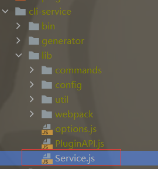

# VueStudy

Vue Notes 这里记录我的vue学习笔记一些案例，然后这个文档是我对学习过程的summary

## Ps.

这里只是简单总结，详细的还是得去看案例，感觉笔记以后看的少，主要是学习的时候记一下增加思考和记录，所以就简单记录了。

## 计算属性

1. 计算属性的基本使用就是解决一些变量的赋值，这些变量是对其他变量的一些操作，这时候就比较喜欢用计算属性了。
2. 计算属性的原理,其实计算属性他是一个对象，平时写成方法其实是语法糖的写法，本质是一个对象里面有set和get方法，然后set方法如果不去写的话，那么这个计算属性就是一个只读属性，没法修改它的值。设置了之后就可，get是必须要写的。
3. 计算属性与方法比较起来有什么不同点，计算属性有缓存，性能比较高，多次用到一个变量的时候，方法是会调用好多次的，但是计算属性调用一次之后有了缓存，就不会多次调用了。

## 事件监听

1. 写法：v-on:click => 语法糖：@click
2. 事件方法传参问题，调用的时候加（），那么接收的第一个参数是undefined。调用时候调用的时候不加（），那么接收的第一个参数是event参数。如果既想传普通参数又想传时间参数，那就传$event，接收之后就是event事件参数。
3. 修饰符，这个有比较多，比如.stop阻止事件冒泡，别的就先不多说了。

## 条件判断

1. 这个其实用的不多，只用来处理一些逻辑比较简单的，如果多层逻辑嵌套的话，就开一个计算属性去处理了。
2. 和v-show的不同，v-show阻止渲染的话其实是加了一个display: none;，而if else是直接不渲染。

## 循环遍历

1. 遍历对象注意的：有三个参数按照顺序分别是（item key index） in obj。
2. 遍历数组主义的：就两个参数（item index） in arr。
3. 只要是用到for循环的时候，就加一个:key="item"，这里其实涉及到vue的渲染机制，他在渲染标签的时候不会第一时间创建，会先看看有没有相同的，加上key后，赋值item，相同的标签就不会多次创建，提高性能。
4. 数组中直接数组名[index]的方式修改是不支持响应式的，还有一些支持响应式的方法等等。

## v-model

这个用的还是挺多的，主要是结合表单使用。

1. 双向绑定问题，简单说就是value <==> message,二者响应式。
2. 实现原理，给value动态绑定，然后input有个事件，随时给value进行赋值。
3. 配合radio使用，不需要name了。
4. 配合checkbox使用.
5. 配合select使用。
6. 一些修饰符

## 组件化开发

这个比较重要了，以后的开发都是组件化(不过自己写点东西怕麻烦不用太组件化

1. 有很多种写法，最主要的我觉得记住语法糖的写法就行。然后模板分离的两种方式，template用的比较多。
2. 然后组件的data是个函数，必须有返回值，设计成这样目的是为了增强组件的复用性。
3.
组件之间的通信，父传子用props，子组件开一个props，里面定义一些变量，可以写成对象的方式，然后接收父组件调用时传的值。子传父，这个使用$emit，进行传值。子组件的方法中调用$emit方法，然后传递方法名（父组件中接收数据的方法）和要传递的数据，然后父组件在这个名字的方法中就可以接收到数据。
4.组件之间访问数据.先说父访问子：事件监听开一个方法，然后$children就可以访问到所有的子组件，然后根据数组索引来获得某一个，this.$children[0]
.name比如这样，然后后续会有改变子组件数量顺序的可能，所以还有另一种方式，要用<cpn ref="xxx"></cpn>
，父组件调用子组件的时候，标签里面要加一个ref属性，this.$refs.xxx这样就可以具体访问到某一个组件，而且不会受索引的影响。然后再说子访问父：this.$parent就是用这个属性，可以返回父亲组件，this.$root这个可以直接访问到根组件，一般是vue实例。然后如果你一个组件被多个父组件进行注册，在访问父亲组件的时候，他会有一个作用域，父亲就是模板所在的组件。

## 组件化开发高级技巧

1. 在子组件模板中开一个slot标签，然后这就是一个插槽，可以在父亲组件模板使用它的时候决定这里展示什么，替换slot的标签写在父组件标签里面,

```html

<cpn>
  <button>按钮</button> <!--这里放替换插槽的内容-->
</cpn>
```

比如这样，然后你也可以给slot一个默认显示内容

```html

<slot>
  <button>按钮</button> <!--这是插槽的默认值 可以没有-->
</slot>
```

这样如果在使用组件的时候里面没有写任何内容，他会显示这个默认的button。

2. 具名插槽，就是给slot标签添加一个属性name，然后再使用的时候slot属性值赋上name的值，就可以一一对应到这个插槽，当然这是一个组件中多个插槽的时候才会用到的。
3. 编译作用域问题，就是你在使用变量的时候，都是以所在模板为作用域。
4. slot-scope的用法，这个可以把子组件的数据通过再slot标签中定义一个属性，一般叫:data，然后值是要传递的数据，然后父组件调用的时候slot-scope="slot"
   ，然后下面slot.data就是刚才子组件想要传递的始据了。

## 模块化以及webpack各种配置

* 太多了以后有时间再整理

## 脚手架

### 简单介绍

* https://cli.vuejs.org/zh/ 这是脚手架的官方文档。
* 脚手架依赖webpack node npm，在3.0版本前叫做脚手架2，之后的是脚手架3，二者的安装方式以及一些配置都有些区别。
* 安装方式：首先要保证有wecpack以及node环境。下面是安装命令，分为npm和yarn的两种方式，但是这样安装完默认是最新版本，也就是脚手架3，所以如果还想用脚手架2的话，需要安装一个桥接工具，下面也写到了，这样以后既可以使用2也可以使用3来创建项目了。

```
npm install -g @vue/cli
# OR
yarn global add @vue/cli

# cli2桥接工具
npm install -g @vue/cli-init
```

### vue-cli2

#### 安装方式

```
vue init webpack 项目名称
```

然后安装过程会有一系列的配置,所示如下

这时候大概就已经把项目搭建起来了，然后解释一下项目目录结构。

* 有时候新电脑安装脚手架会出现错误,把下面这个文件夹删除就好了

```
C:\Users\Lenovo\AppData\Roaming\npm-cache
```

#### 项目结构解释


#### ESlint

eslint是对代码规范的一些限定 ，这个就算建立项目的时候安装了也是可以关闭的，在项目根目录的config里面的index.js文件里有个配置,改成false就关闭了

```
useEslint: true
```

#### runtime-compiler和runtime-only的区别
这是在初始化项目的时候配置的一个选项，虽然提示大多数人选择runtime-compiler，但是其实后者更好，有点也在下面说明了
```
  // runtime-compiler
  // template -> ast -> render -> vdom ->UI
  // 这是runtime-compiler的编译过程，他需要经过template到ast的过程最终才能到render渲染的步骤
  
  // runtime-only(1.这种方式性能更高 2.下面的代码量更少)
  // render -> vdom -> UI
  // 而runtime-only不需要经过模板的过程，直接到render，所以在main.js文件中，组件的注册方式也是不一样的，这个是用render函数进行导入
```
下面说一下在main.js里面注册组件时候的区别
```javascript
// runtime-compiler
new Vue({
  el: '#app',
  components: { App },
  template: '<App/>'
})
```
```javascript
// runtime-only
new Vue({
  el: '#app',
  // 解释一下这个render函数
  // render: function (createElement) {
  //   return createElement('h1',
  //       {class: 'box'},
  //       ['HelloRender',createElement('button',['按钮'])])
  // }
  // 实际挂在是用这样，这里使用了箭头函数，其实就是个render函数，里面吧app组件传值进去就可以
  render: h => h(App)

})
```

### vue-cli3
cli3和cli2还是有很多区别的，最主要的是build和config文件夹全部消失了
#### 创建项目
```
vue create hello-world
```
然后是创建过程中的一些配置，应该能看明白，我就不注释了

我进去项目看了一下main.js我才明白过来，前面我选择的是vue3啊,怪不得vue实例那里我看不懂，我还以为前面让我选的是cli3。然后我就又重新创建了个vue2的（是用vue-cli3创建的vue2
#### 目录结构

这些文件我发现跟我学习的少了一点，少了配置浏览器的哪个还有package-lock以及css预编译什么东西，大概是又更新了吧。
#### 入口文件
```javascript
import Vue from 'vue'
import App from './App.vue'

// 这个单独来解释一下，这是一个什么警告，一般开发的时候就选择false，发布的时候改成true
Vue.config.productionTip = false

new Vue({
  render: h => h(App),
}).$mount('#app')
```
现在的写法是这样的，这个$mount就取代了之前的el挂载，然后还是使用的render函数。
#### vue-ui和webpack配置的修改
通过vue-ui进行的一些配置
##### ui的一些介绍
在cmd中运行vue ui命令可以打开vue的图形化界面系统，在这里导入你的项目之后有几个地方简单说明一下。
这里可以进行一些插件的安装

这里可以进行一些依赖的安装，当然也可以卸载

上面这两个地方对应项目中的package.json里面的devDependencies。

然后这个配置是进行一些webpack的相关配置，这里不详细说明了，因为我学的这块也不是很仔细，以后还得再看。

##### 配置被隐藏在哪儿以及怎样修改（webpack）
然后对于webpack配置的修改并不是只能在这里进行修改
为什么cli3中的所有的webpack配置都没有了呢？并不是消失了，而是隐藏在node依赖中，也就是node_modules里面的@vue文件夹

这里面是一些具体的细节的配置，然后被导出在下面这个service这个文件夹中

最后被下面这个文件夹导入

设计原则--零配置
如果确实想更改一些配置，就要新开一个文件，名字固定必须是vue.config.js，在里面写一些配置之后打包，就会合并到最终的配置中去


### vue-router
#### 前/后端渲染与前/后端路由
这里介绍前后端开发模式的历程，以及对于渲染方式以及路由管理的介绍。
路由就是一种映射关系，前端路由交给前端管理url与html css等资源的关系，而后端路由是由后端来做这种事情。<br>
##### 第一个阶段--后端渲染

整体项目的架构如上图所示，这是最早的一种开发模式，前端只进行一些静态页面的构建，动态的数据绑定等等的工作全部交给后端来处理。比较典型的一个例子就是jsp，当然这种方式也是采用后端路由，后端进行url与静态资源的映射关系，这时候前后端还没有分离，所以后端任务量巨大，项目不好维护也不好合作。
##### 第二个阶段--前后端分离

如图所示，这个阶段似乎没有明确的前后端路由概念，但是已经开始进行前端渲染了，大部分页面都是由前端的js代码进行页面展示，不需要后端再去处理前端html的东西了。
##### 第三个阶段--SPA单页面复应用

这个阶段也就是现在正处于的阶段，前端渲染并且由前端管理路由。整个web系统只有一个页面，也就是只有一套html css js，前端处理好映射关系之后，请求服务器，一次就把所有的前端代码请求下来了，每次url改变的时候页面不刷新，也就是不会再次请求服务器（这里还是需要再做一些处理才能实现）。只从代码里面将这个页面的组件模块给抽离出来，进行渲染。然后对api接口的请求还是如同之前的js接口实现。
#### 路由实现url改变而不请求资源的实现机制
<br>
主要的是两种方式，一种是location修改url的hash，另一种是html5的history的pushState方法，这个相当于压栈，所以他还有类似栈的一些操作。
<br>
history还有go方法，go（-1）相当于弹出一个栈，与之对应的方法是.back。go（1）是压进去刚才弹出来的栈，相当于.forward
#### 安装路由
各种配置
#### 路由映射配置和呈现
映射配置就是在router文件夹里面的index文件，在里面进行各种路由配置。
呈现是将你的组件根据你的映射关系的路由地址，来决定渲染哪一个组件，就是之前说的spa，单页面复应用，都渲染在app.vue这个组件里面，然后在里面设置router-link，配置对应的路由，然后进行渲染。
```javascript
    <router-link to="/home">首页</router-link>
    <router-link to="/about">关于</router-link>
    <router-view><router-view> /*这是决定你的组件显示的位置*/
```
呈现的地方如上面代码所示，这些都是写在app.vue里面的
#### 重定向
由于默认路径''，所以你不点击router-link触发路径跳转的时候页面是空白的，所以要给‘’这个路径进行重定向，就是在路由配置文件里的routes里面添加一个对象，配置如下
```javascript
  {
    path: '',
    redirect: '/home' // 这是修改默认路径，重定向到Home
  },
```
#### 路径hash值改成history模式
```javascript
const router = new Router({
  routes, // 这里必须是routes
  mode: 'history', // 将url的hash形式改为history，这样就是不会显示#，
})
给router再添加一个属性，mode可以更改
```
#### router-link标签里面的属性
* tag可以更改显示出来的标签
* replace不可返回
* active-class，默认活跃的link会有一个router-link-active,可以利用这个直接设置一些活跃的标签的css,但是这个比较长，可以用active-class修改这个class，然后在router配置文件里面的router里面加这条属性  linkActiveClass: 'active',这样所有的活跃link的class都是active了。
```css
.active {
  color: blue;
}
```
#### 代码手动路由跳转
很简单，app.vue里面看看就行

#### 动态路由
就是每个路由下面有多个路由页面，/user/zhangsan这样的。
#### 打包之后的文件解析
<br>
这是vue项目实际打包之后的结构
#### 路由懒加载 
需要懒加载的原因是如果项目巨大，所有的js文件都放在app那个文件里面，请求时间过程的话可能页面会有一段时间是空白，懒加载是把一个个组件给分离开，这样就是用到哪个组件请求哪个，实现方式就是修改路由文件里面组件的导入形式，我的项目代码里面有（4router里面第一个项目），然后打包在dist里面的js文件夹有，就会生成对应的组件js文件
#### 嵌套路由
就是children属性，可以存放一些子路由
#### router参数传递
通过$route可以访问到query的数据。<br>
```
http://localhost:8080/profile?name=zzb&age=21&height=181
```
这里后面多了一些东西也就是?后面的，其实这就是query（查询）<br>
详细解释的话这里得说一下url的各部分组成，这里拿维基百科的图片

解释一下就是：<br>
协议://主机:端口:/路径?查询<br>
scheme://host:port:/path?auery#fragment
#### vue-touter参数传递
1. 方式一 动态路由--传递一个参数
   配置好动态路由后，在子组件里面通过$route.params.（动态路由：后面那个参数）就可以获得到路由最后的那个参数。
2. query的方式--传递大量数据
   在给router-link的to赋值的时候，里面也可以放一个对象{}，然后里面各种参数的配置如下。
```
{
  path: '/profile',
  query: {
    name: 'zzb',
    age: 21,
    height: 181}
}
```   
path就是放地址的地方，后面的query可以起到传递参数的作用，加上query之后，里面这些参数，可以在子组件中通过$route.query.name来访问到，而且这时候浏览器上面的url也会多一些query.
当然，你也可以自己写个button或者其他东西来实现路由跳转并且传递query,代码如下。
```javascript
    profileRouter() {
      this.$router.push({
        path: '/profile',
        query: {
          name: 'zzb',
          age: 21,
          height: 181
        }
      })
    }
```
#### $router和$route
$router是你在router配置文件里new出来的vue对象，不管你在哪什么时候用$router都指向它。
而$route指的是目前正处于活跃的路由的一个对象。
#### 导航守卫
每次跳转路由的时候，如果想跟着改对应的网页标签名：
第一种方法是在每个组件里面都写一个生命周期函数，create的时候document.title给改了，但是这样比较麻烦。
第二种方式，在router配置文件里面添加下面代码
```javascript
router.beforeEach((to, from, next) => {
  // 从from跳转到to
  document.title = to.matched[0].meta.title
  console.log(to);
  next() // next()函数一定不能忘记调用，否则页面无法完成路由跳转
})
```
这个函数可以在每次路由跳转的时候调用，给每个组件的路由添加一个meta对象，然后在里面添加一个title，就能使用如上方法，但是这个matched是干嘛的呢，是防止动态路由出现undefined的情况。
```javascript
    meta: {
      title: '档案'
    }
```
导航守卫其实就是一些钩子函数，这里不仅有前置守卫beforeEach，还有后置钩子afterEach，这俩都是写在router的index.js文件里面的作为全局导航首位。它也有某个路由的导航守卫，还有某个组件的导航首位，详细的可以去官网查看。
#### keep-alive
保证离开某个组件的时候不会被销毁（不要让组件频繁销毁，保留一些状态），而且使用keep-alive的时候才能用组件自己的两个钩子函数（activated/deactivated）。
下面我来解释一下这里遇到的一个🕳，这里的home组件下面还有俩子组件news和message，为了实现跳转其他路由的时候这俩组件有缓存，就是选中了message跳走再调回去不会改变，这里用keep-alive吧view-router给包了起来，可以用ceeated和destroyed这俩钩子函数检验一下，看看是不是这样之后组件就不会循环创建和销毁了。然后这里因为路由的各种问题，导致没法直接实现刚才说的那个需求，所以需要用钩子函数和导航守卫来配合一下，
```javascript
  activated() {
    this.$router.push(this.path)
  },
  beforeRouteLeave(to,from,next) {
    this.path = this.$route.path;
    next()
  }
```
最后是这样实现了这个需求，当然这个path已经再上面的data里面定义了。就这样实现了这个一时兴起的需求。
然后这里强调一下导航首位。导航守卫和钩子函数还不太一样，钩子函数是写在组件里面的，也就是.vue文件，但是导航首位分为多种，全局导航首位，写在router配置文件里面，组件内导航首位，还有路由独享的导航首位，这些具体的各种导航守卫还没仔细的去看。https://router.vuejs.org/zh/guide/advanced/navigation-guards.html,这是官方文档可以看看。
#### keep-alive的属性
1. include -- 只有匹配的组件会被缓存
2. exclude -- 匹配的组件不会被缓存
```javascript
    <keep-alive exclude='Profile,About'>
    这代表Profile和About这俩组件不会被keep-alive
```
